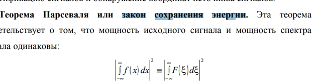
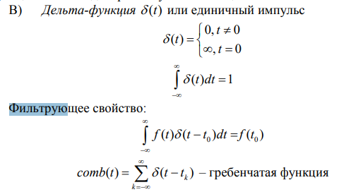
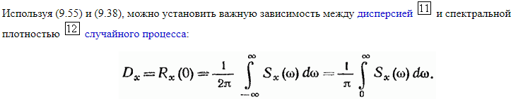
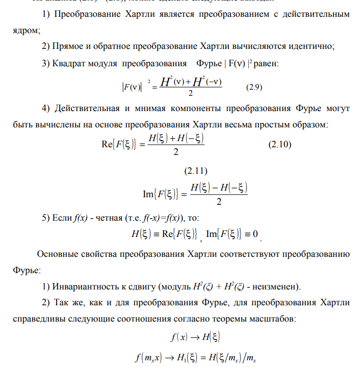
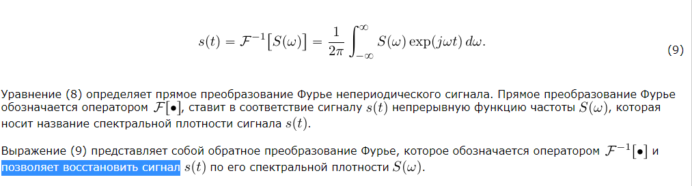
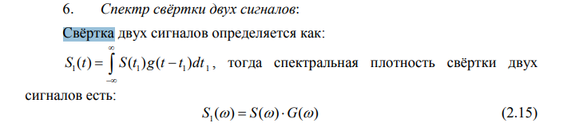

# Вариант 2

1. Поясните, какие способы модуляции возможны при использовании гармонического носителя.

    - Амплитудная модуляция
    - Фазовая модуляция
    - Частотная модуляция

2. Укажите основные этапы цифровой обработки сигналов.

    - Предварительная обработка сигнала (преобразование из аналогого в цифровую форму)
    - Первичная обработка сигнала
    - Вторичная обработка сигнала (классификация сигнала)

3. Какими свойствами должен обладать периодический сигнал для того, чтобы он был бы представлен корректно в частотной области?

    - Число экстремумов - конечное
    - Число разрывов 1-ого рода - конечное
    - Не должно быть разрывов 2 рода

4. Являются ли коррелированными сигналы с непересекающимися спектрами? Ответ поясните.

    Нет т.к. их взаимный спектор равен нулю

5. Теорема Парсеваля.

    

6. Что понимается под стационарным случайным процессом?

    Это процесс у когорого все статические характеристики одинаковы для всех временных сечения.

7. В чем состоит фильтрующее свойство дельта-функции?

    

8. Как взаимосвязаны дисперсия и спектральная плотность мощности центрированного случайного процесса?

    

9. Поясните назначение метода синхронного накопления сигнала.

    Метод для увеличения соотношения сигнал/шум на выходе. Применим, если полезный сигнал в течении времени приёма постоянный или периодичный.

10. Каким образом связаны между собой преобразование Фурье и преобразование Хартли?

    

11. Что понимается под белым шумом?

    Случайный процесс, у коготоро PSD постоянна. Математическая абстракция

12. Возможно ли точное восстановление сигнала по его спектральной плотности?

    

13. Поясните, что понимается под сверткой двух сигналов. Каким образом она может быть вычислена?

    

14. Что понимается под интервалом корреляции для случайных сигналов?

    Это числовая характеристика для оценки скороси изменения реализации случайного процесса