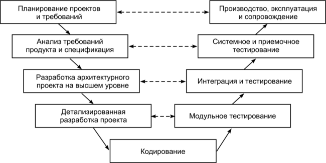

# Введение

## Термины
* Mistake - ошибка/просчёт человека
* Fault - дефект/изъян по в результате ошибки
* Failure - неисправность/отказ
* Error - невозможность выполнить задачу
* BUG - неформально обозначает дефект/отказ/error

## Уровни восприятия тестирование

0. тестирование - это отладка
1. тестирование - это способ показать корректность ПО
2. тестирование - это способ поиска ошибок
3. тестирование - может показать наличие ошибок
4. тестирование - возможный способ оценки качества ПО

## Способы повышения качества продукта
* Тестирование
* Разработка стандартов
* Обучение персонала
* Анализ дефектов (ревью/совещания)

## Цели тестирования
* Обнаружение дефектов
* Предотвращение дефектов
* Повышение уверенности в продукте
* Повышение пользовательского доверия
* Принятие решений на основе результатов тест

## Способы повышения уровеня доверия
* Число дефектов за некоторое количество времени
* Сформировать требования надёжности

## V-model

## Статическое и динамическое тестирование
Статическое обычно проводится до этапа разработки, не включает выполнения кода, проводится сквозной контроль/инспекция.
Динамическое тестирование запускает куски кода/модули/всю систему.

## Источники данны для тестирования
* Описание ПО (чёрный ящик)
* Исходный код (белый ящик)
* Архитектурные модели

## Принципы тестирования ISTQB
1. Тестирование демонстрирует наличие дефектов
2. Исчерпывающее тестирование невозможно
3. Раннее тестирование
4. Принцип скопления дефектов (обично групируются в модулях)
5. Парадокс пестицида (чем больше удаляете баги, тем больше )
6. Тестирование зависит от контекста
7. Ошибки всегда присутствуют
