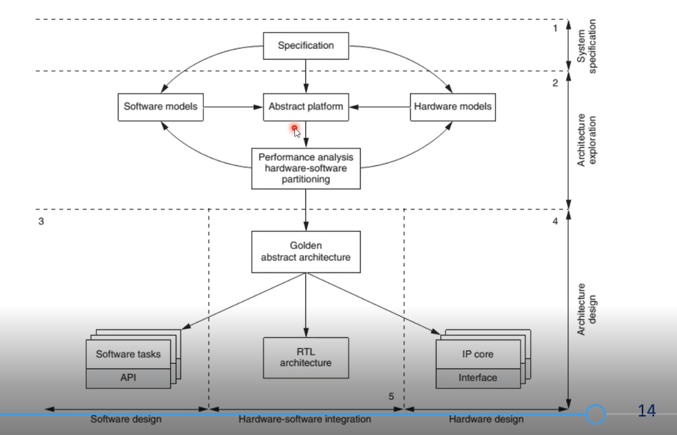

# Лекция 1 Введение. Основные понятия

## СнК (схема) 
Это интегральная схема, объединяющая в себе функциональность целой вычислительной системы и вклюающая полный набор перефирийных блоков, необходимых для решения прикладной задачи.

Каноническая структура:
* FPGA
* Memory
* DSP
* A/D
* Microcontroller
* Costume-hardware

## СнК (технология) 
Это технология проектирования вычислительных систем, выполненных в виде интегральной схемы. Основной упор/акцент - переиспользование IP компонент, стандартизация интерфейсов.

## IP
Интеллектуальная собственность - это переиспользуемый компонент, выполненный в виде описания логического блока, схемы компоновки интегральной схемы.
Жесткие IP - привязаны к определенному технологическому процессу.
Мягкие IP - не привязаны к определенному тех. процессу, определенной фабрике (можно синтезировать под нужды)

Виды IP:
1. IP-библиотеки базового уровня
2. IP модули памяти
3. Интерфейсные модули
4. Процессорные IP-ядра
5. Аналоговые блоки
6. Вычислительные платформы

## Способы организации взаимодействия
1. Bus (общие шины) - некоторые шины связывают набор компонент. Однако шины занимают место на чипе, накладывают ограничения на разводку, топологию.
2. Сети на кристалле (NoC). В такой сети также есть что-то типа коммутаторов, которые коммутируют пакеты для IP ядер. Это добавляет более гибкое общение ядер, по сравнению с bus.

# Методологии проектирования СнК
## System-based design
Проектирование начинается с создания спецификации, далее идет спуск на следующий этап (идёт уточнение) и так до реализации.

1. Создается спецификация (не разделяется на HW/SW)
2. Абстрактная платформа
3. Производится замер (performance analysis) HW/SW
4. Получаем Golden abstract architecture

### Модели вычислений
* Конечные автоматы
* Системы взаим. процессов
* Сети Петри
* Сети процессов Кана
* Модель дискретных событий
* Модель акторов

## Component-based-design
Прикладная задача решается с помощью готовых IP блоков. Акцент смещается не на разработку блоков, а на проектирования структуры и взаимодействия этих блоков (среда, приоритезация, диспетчеризация).

## Platform-based-design
Подход основан на реализации продукта на основе готовых платформ, совокупность компонентов, которые соединены определенным образом. Платформа - зафиксированная архитектура на определенном уровне абстракции, может быть в виде моделей, чипа.

# Проект СнК
После выполнения проекта СнК он может быть выполнен в виде:
1. ASIC (application specific int. circuit) - специализированная микросхема для определенной задачи. Плюсы: большая частота, компактность.
2. FPGA - микросхема программируемой логики: гибкость, но маленькие частоты +-300mhz.
3. Structured ASIC - частично программируемые. Намертво делается логика, но конфигурационные ячейки могут 1 раз переиспользоваться.

## Дезинтеграция полупроводниковой индустрии
Все производство тяжело выполнить от начала до конца. Поэтому компании занимаются лишь в определенном сегменте рынка.

1. IP provider - создают IP блоки и продают их.
2. EDA Vendor - создают средства разработки, САПР.
3. Design Services - под заказ некоторых услуг (тестирование)
4. Embedded software - проектирование ПО.

Потом они поставляют свои услуги для компаний, которые хотят выпустить свои устройства (Semiconductor Chip Companies)

Затем идут на фабрики TSMC, UMC.

Затем идут на упаковку (IC Packaging House)
