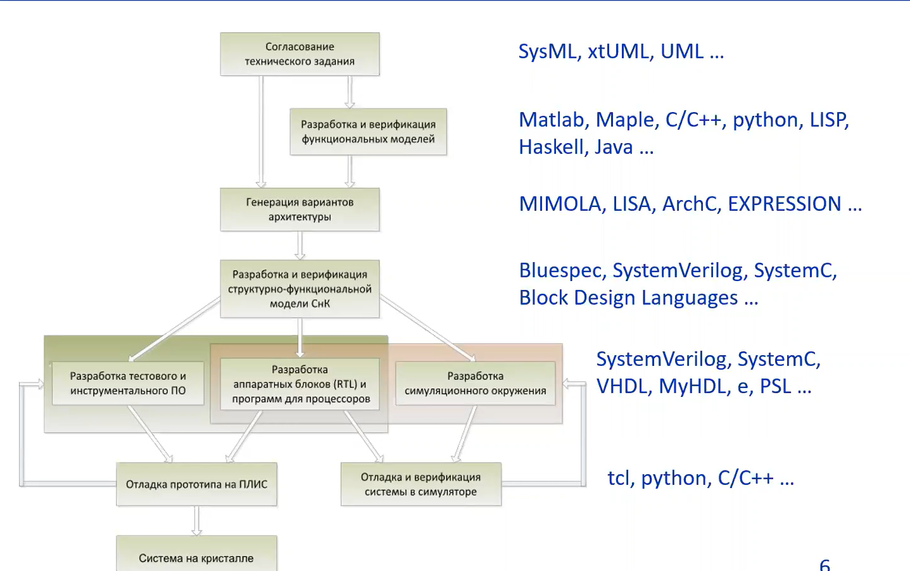
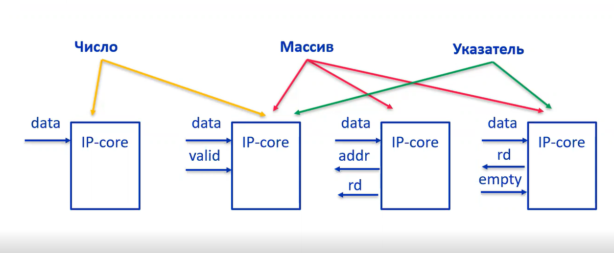
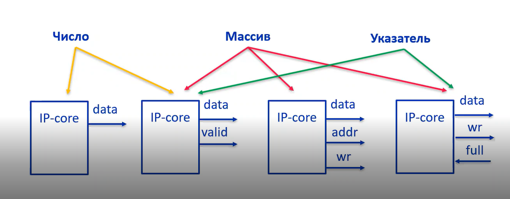

# Лекция 2 High-Level Synthesis

## HLS
Это технология высокоуровневого синтеза. Синтез - сборко целого из составных частей. Под уровнем понимается уровень абстракции. Например, синтез из C/C++ алгоритма в описание схемы аппаратного ускорителя.

HLS позволяет:
* анализ и звлечение операций, которые могут выполняться параллельно, осуществляет планирование.
* генерация интерфейсов и контроллеров I/O
* генерация устройства управления (реализует вычислительный процесс)
* оптимизация проекта по времени/площади/энергопотреблению. Такой процесс может быть несходящимся (не может выполнить требования)

## Формализация
Формализация - это процесс, результат которого является представление информации об объекте в форме, доступной для передачи/обработки.

Таким образом, результат формализуется на каждом этапе, происходит автоматизация проетирования и повышается переиспользование компонент.

Далее представлены языки для формализации каждого этапа проектирования.

## САПР
* Vivado HLS
* Catapult HLS
* Synphony HLS
* HLS Compiler
* и т.д.

## Операции синтеза
1. Scheduling - планирование вычислительного процесса, распределение операций по тактам (желательно синхронная схема).
2. Binding - определение ресурсов
3. Control logic extraction - конечный автомат, занимающийся пересылкой данных, результатов.

## Трансляция ресурсов
* Функциональный блок - функция (IP-ядро)
* Аргументы - порты IO
* Переменные - элементы памяти (регистровые, блочные)
* Циклы - однотактовые/многотактовые/конвейерные блоки

## Несинтезируемые ресурсы
1. Interruption
2. Рекурсия
3. alloc (динамическая память)
4. Системные вызовы
5. Приведение к void* (неопределенный размер)

## Синтез
Latency - время между подачей входных данных и получением результата
II - минимальное время между посылками новых порций данных.

### Оптимизация циклов
* Loop unrolling - цикл разворачивается в группу одинаковых действий.
* Конвейеризация - совмещение стадий и их параллельное выполнение.
* Loop merging -

### Аргументы
Допустимые типы:
* Числа
* Массив
* Указатель

Типы интерфейсов:
* без логики управления (непосредственная передача)
* интерфейс с протоколом рукапожатия
* интерфейс памяти
* интерфейс очереди
* стандартизированные интерфейсы (AXI, AXI Lite ...)

Входные порты: число может быть непосредсвенной передачей или с протоколом рукапожатия (полное и не полное). Массив может быть отображен как с протоколом рукапожатия, как интерфейс памяти, как интерфейс очереди. Указатель синтезируется как с интерфейсом рукапожатия, так и с интерфейсом очереди.

Выходные порты: число отображается как без логики управления, так и с рукапожатием. Массивы отображаются на интерфейс рукапожатия, интерфейс памяти или интерфейс очереди. Указатель как рукапожатие и интерфейс очереди. 

### Оптимизация массивов
* Горизонтальное отображение - массивы склеиваются и их элементы идут последоватльно в памяти. arr1 и arr2: `arr1[0], arr1[2], ..., arr1[N], arr2[0], ..., arr2[M]`. Упращяет доступ к элементам массива, но увеличивает количество слов памяти.
* Вертикальное отображение - массивы склеиваются поэлементно в одно слово, например элемент arr1 в младших битах слова, а arr2 в старших: `(arr1[0] arr2[0]), (arr1[1] arr2[1]), ..., (arr1[N] arr2[N]), ..., (___ arr2[M])`. Увеличивается размер слова, но уменьшается их количество.
* Переупорядочивание - определенные x элементов массива склеиваем в одно слово склеиваем.
