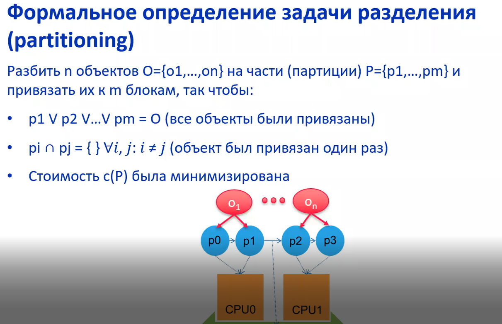

# Лекция №4 Методология HW/SW codesign

## Определение

* `HW/SW codesign` - процесс совместного и скоординированного проектирования электронных программно-аппаратных систем, который основывается на не зависящем от конечной реализации описании и использует средсва автоматизации проектирования.

При HW/SW codesign используется синергизм аппаратуры и ПО с целью оптимизации и/или удовлетворения проектных ограничений, таких как стоимость, производительность, энергопотребление и т.д.

Важно понимать, что HW и SW проектирование идёт параллельно. И поэтому надо организовать совместную работу команд HW и SW для достижения оптимального результата, например, некоторые функции выделить в отдельные аппаратные блоки.

Идеальный по производительности будет, если все вычисления производятся на аппаратных блоках, а алгоритм управления на программируемых процессорах.

## Цели co-design

### Co-ordination (coordination/координация)

Цель - координация этапов проектирования различных проектных групп, таких как:
* Application dev
* Middleware dev (ОС разработчики)
* Firmware dev (разработчики встроенного системного ПО)
* Integrated chip dev (разработчики топологии/дизайна интегральных схем)
* Hardware dev (разработчики аппаратного обеспечения)

Должна быть колоборация групп, например, разработчики программного обеспечения должны знать ограничения аппаратуры, а разработчикик аппаратного обеспечения должны знать специфику работы программного обеспечения.

### Co-ncurrency (concurrency/параллельная)

Цель - согласованная и одновременная работа аппаратых и программных разработчиков.

Позволяет избежать узкого места как в SW, так и в HW. Рабочие группы должны взаимодействовать друг с другом и периодически демонстрировать свои прототипы. Прототипом для HW может служить *косимуляция* и *виртуальное прототипирование*

Косимуляция и виртуальное прототипирование лишь симулирует работу реальной аппаратуры, при этом используетя **модельное время**, однако такие симуляции слишком сильно приближены к идеальным условиям, в связи с чем большое количество багов всё равно останется неизвестным.

### Co-rrectness (correctness)

Цель - коверификаиця работы различных уровней/подсистем в составе всей системы.

Происходит сквозная верификаци проекта СнК на каждом уровне и на каждом этапе, также происходит отслеживание зависимостей на разных уровнях проектирования и проверка соответсвия. Однако проверка зависимостей возможна лишь для примитивов, которые имеют однозначное соответсвие для другого уровня, например на уровне вентельном и на уровне топологии однозначное соответсвие есть у межвентельных линий. Все зависимости отследить невозможно т.к. менияется уровень детализации.

### Co-mplexity

Цель - получение оптимального результата по критериям/требованиям, указанных в спецификации.

## Dive Into History

### Первое поколение 
* Типовая архитекура: ЦП - Общая шина - Ускоритель
* Синтез аппаратуры из C-подобном языке/спецификации
* Получается либо полностью аппаратная реализация или полностью программная реализация
* ЦП простаивает, пока работает ускоритель и наоборот

### Второе поколение
* Многопоточность исполняемой программы/параллельная работа ускорителья и ЦП
* Появление косимуляции

### Третье поколение
* Появляются гетерогенные вычислительные системы и усложняются их взаимодействия
* Полностью автоматизированный межуровневый синтез

### Четвертое поколение
* Тесная интеграция аналоговой и цифровой части
* Использование кибер-физических систем
* Перемещение дизайна в runtime фазу. Развитие концепции реконфигурируемых и обучаемых систем.

## Задачи синтеза

* Allocation - выбор ресурсов, включающих процессоры, аппаратные IP и их межсоединения.
* Binding - связывание функциональности с выбранными ресурсами.
* Scheduling - планирование ресурсов между процессами

В терминах codesign:
* Mapping - отображение функциональности и их планирование
* Partitioning - выбор ресурсов и их связывание с функциональностью

## Разделение (partitioning)

Методы:
* Перебор - очень долго
* Линейное программирование - минимизация целевой функции
* Случайное отображение - рандом
* Иерархическая кластеризаиця - выбирается некоторая эвристика для модулей
* Эволюционные алгоритмы
* Алгоритм Кернингана-Лина
* Алгоритм имитации отжига

